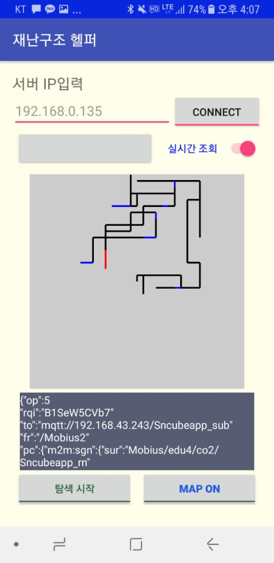
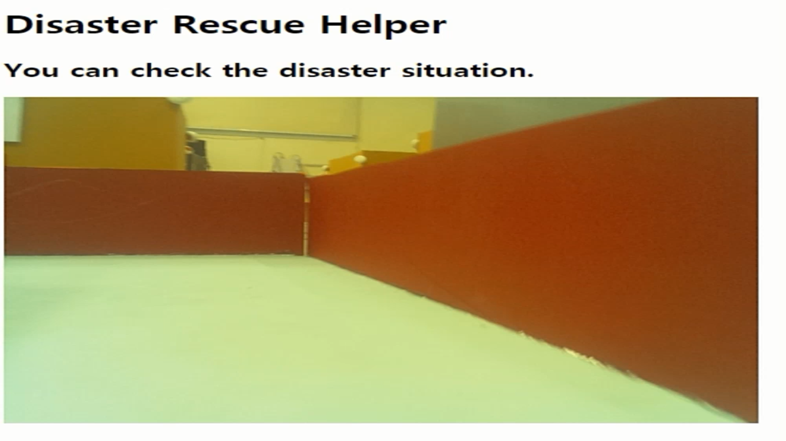

<h2><b>Disaster Rescue Helper</b></h1>
<ul>
  

  <li><b>Description</b></li>
  : This is a project in 2018-1 "IT Concentration Education" class. This project aims to help rescue team searching the internal structure in advance by Disaster Rescue Helper. In this project, a virtual maze describing the collapsed inner building structure was created. Through the virtual maze, the robot quickly searches the situation based on Wall Following Algorithm, and at the same time, transmits direction information and outputs the internal structure map in real time to android app. In addition, the Raspberry Pie Camera transmits the internal photographs to the web consistently, allowing the rescue team to monitor the internal situation in real time. Lastly, imaginary danger zones and safe zones painted in different colors in the maze are judged as color sensors, and the map showing danger and safe zones is displayed on android app.

  <li><b>System Structure</b></li>
    
  <li><b>Function</b></li>
  <ol>
    <li><b>Wall Following</b></li>
    
    video link : https://youtu.be/WoG5qpObs9I  
    <li><b>Map Drawing</b></li>
    
     video link : https://youtu.be/As0OZFY861E  
    <li><b>Live Cam In Disaster Area</b></li>
    
    video link : https://youtu.be/cEtv8_-h39E  
  </ol>
  <li><b>Developers</b></li>
  - Soonwon Choi (https://github.com/iamsoonwonchoi) 
  - Shinhyuk Park (https://github.com/snhpark) 
  - Hyejin Park
</ul>
